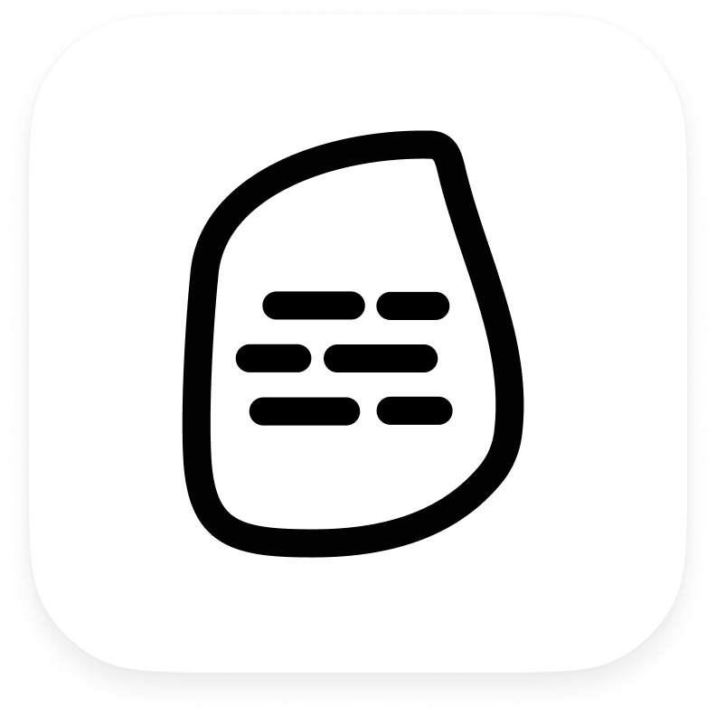

<h1 align="center">
  
   Rosetta 
</h1>

<h3 align="center">
  Online Questionnaire Application
   
  Designed by Chengxin Zhao 2023 - OBU Granduate Project
</h3>

## Features

This software is mainly divided into two parts: questionnaire sender and questionnaire receiver. 
- The questionnaire sender can mainly design questionnaires, choose from seven different types of questionnaires, freely combine and modify them, and set the usage type of the questionnaire, whether it is long-term research or one-time research. The questionnaire designer can share the questionnaire through unique codes or QR codes generated by the software. After the questionnaire is filled out by the respondents, the designers can view the data through data visualization graphics in the software. The questionnaire designer can also update, delete, and perform other operations on the questionnaire through the software. 
- The questionnaire receiver can accept the questionnaire survey request and fill out the questionnaire through unique codes or QR codes. If the questionnaire is a long-term one, they can view the questionnaires on the homepage and fill out the questionnaire again when the investigator needs to conduct research.

